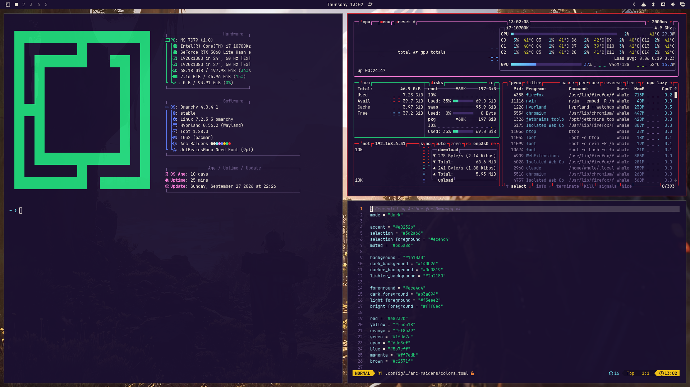

# Arc Raiders for Omarchy

Say what you want about Arc Raiders, but you gotta admit, it's got a cool style. This is an [Omarchy](https://omarchy.org) theme based on the colors and style of Arc Raiders: deep purple backgrounds, warm cream text and a hot red accent.



## Install

```bash
omarchy-theme-install https://github.com/OutOfTheWhale/omarchy-arc-raiders-theme
```

Or open the Omarchy menu and go to **Install → Style → Theme**, then paste the repo URL.

## Palette

| Role       | Color     |
|------------|-----------|
| Background | `#1a1030` |
| Foreground | `#ece4d4` |
| Accent     | `#e8232b` |
| Selection  | `#3d2a66` |
| Yellow     | `#f5c518` |
| Green      | `#1fd67a` |
| Cyan       | `#6de3ef` |
| Magenta    | `#ff7edb` |

The theme also includes 17 wallpapers and the `Yaru-magenta` icon theme.

## Credits

Arc Raiders and its artwork are the property of [Embark Studios](https://www.embark-studios.com). The wallpapers in `backgrounds/` are included for personal desktop use and are **not** covered by this repo's license. This is a fan-made theme and isn't affiliated with or endorsed by Embark Studios.

## License

The theme files are released under the [MIT License](LICENSE). The wallpapers are not covered (see above).
